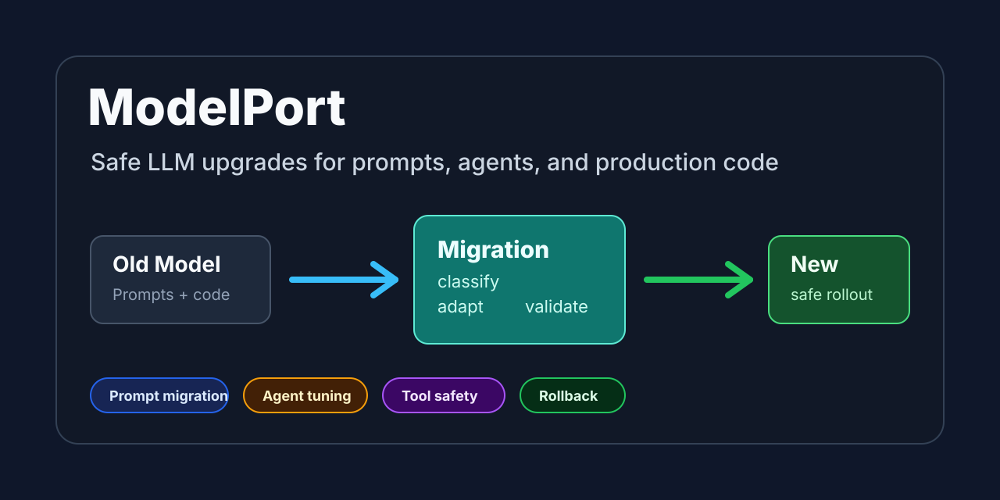

# ModelPort

[](https://github.com/forkadarshp/MPort/actions/workflows/ci.yml)
[](LICENSE)
[](SKILL.md)
[](CONTRIBUTING.md)
[](docs/PUBLISHING.md)



**Production-grade LLM migrations: Swap models safely across agents, prompts, and code.**

An AI agent skill for safe, production-grade LLM model migrations. Automate behavior-preserving upgrades across prompts, agents, API callers, and tests. Universal and plug-and-play across Codex, Claude Code, Cursor, and more.

**The Problem:** Most model migrations fail after you change the model ID because search-and-replace breaks tool calling, parser behavior, and orchestration.  
**The Solution:** ModelPort treats migration as a behavior-preservation problem: it maps callers, separates required compatibility fixes from optional tuning, and mandates validation before finishing.

## Now shipping: Claude Opus 4.8 (released 2026-05-28)

Opus 4.8 is live, and ModelPort already ships a dedicated migration guide for it:
[`references/models/claude-opus-4-8.md`](references/models/claude-opus-4-8.md).
It covers the **4.7 → 4.8 drop-in path**, the **4.6 → 4.7 breaking changes you
must apply first** (non-default sampling params now 400, manual extended
thinking → `{type: "adaptive"}` + `effort`, new tokenizer, removed assistant
prefills), and **effort re-baselining**. Point the skill at your repo:

```text
Use $modelport-skill to migrate this codebase to claude-opus-4-8.
Apply required compatibility fixes first, keep tool + output behavior stable,
and return validation evidence plus rollback notes.
```

## Our approach to migration

ModelPort treats a model swap as a **behavior-preservation problem**, not a
search-and-replace. The model ID is one line; the behavior around it — tool
calls, parsers, output contracts, prompts, orchestration — is everything else.
The skill drives a strict, phase-gated pipeline that maps every caller,
classifies each hit before editing, keeps required fixes apart from optional
tuning, and refuses to claim "done" without proof.

```text
╭──────────────────────────────────────────────────────────────────────╮
│                                                                      │
│   [ Opus 4.7 ]  ═══>  ( ModelPort )  ═══>  [ Opus 4.8 ]              │
│   drop-in upgrade    behavior-preserving    GA · 2026-05-28          │
│                                                                      │
│   » phase 0   lock scope, read current state ················· [ OK ]│
│   » phase 1   discover callers, prompts, agents, tools ······· [ OK ]│
│   » phase 2   classify every hit before editing ·············· [ OK ]│
│   » phase 3   design: required fixes vs optional tuning ······ [ OK ]│
│   » phase 4   surgical patches, no blind search/replace ······ [ OK ]│
│   » phase 5   validate: tests + live smoke + contract ········ [ OK ]│
│   » phase 6   report: proof evidence + rollback notes ········ [ OK ]│
│                                                                      │
╰──────────────────────────────────────────────────────────────────────╯
```

## Outcomes: with vs. without ModelPort

Skipping the discipline is exactly where migrations look fine in review and
then silently regress in production — broken tool calls, drifted output
contracts, no proof, and no way back.

```text
╭───────────────────────────────────┬───────────────────────────────────╮
│  WITHOUT ModelPort                │  WITH ModelPort                   │
├───────────────────────────────────┼───────────────────────────────────┤
│   x  find/replace the model ID    │   ✓  scope-locked discovery       │
│   x  tool calls break silently    │   ✓  callers mapped, not guessed  │
│   x  parser / output drift        │   ✓  output contract preserved    │
│   x  prompt hacks carry over      │   ✓  fixes vs tuning kept apart   │
│   x  "looks fine" — no proof      │   ✓  tests + live smoke evidence  │
│   x  no way back on breakage      │   ✓  rollback notes included      │
├───────────────────────────────────┼───────────────────────────────────┤
│   →  silent prod regressions      │   →  behavior-preserving upgrade  │
╰───────────────────────────────────┴───────────────────────────────────╯
```

## Why teams use it

- Replace deprecated model IDs without breaking runtime calls.
- Preserve output contracts, parser behavior, and tool calling.
- Separate required compatibility fixes from optional prompt tuning.
- Choose direct swap, adapter, shadow mode, canary, or phased rollout.
- Produce validation evidence and rollback notes.

## Quick start

Install ModelPort globally for all compatible AI agents (Codex, Claude Code, Cursor, etc.) using the universal skills CLI:

```bash
npx skills add forkadarshp/MPort
```

*Alternatively, if you use multiple agents on the same machine:*

```bash
npx agent-skills-cli add forkadarshp/MPort
```

### Manual Installation (Advanced)

If you prefer to fork and modify the skill locally:

Clone:

```bash
git clone https://github.com/forkadarshp/MPort.git
cd MPort
```

Install as a local skill with a symlink (Codex example):

```bash
mkdir -p ~/.codex/skills
ln -s "$(pwd)" ~/.codex/skills/modelport-skill
```

Or copy directly:

```bash
mkdir -p ~/.codex/skills/modelport-skill
cp -R . ~/.codex/skills/modelport-skill
```

Then ask Codex:

```text
Use $modelport-skill and the starter prompt template to migrate
services/assistant from Model A to Model B. Keep tool behavior stable, separate
required fixes from optional tuning, and include validation evidence plus
rollback notes.
```

For detailed migration requests, start from
[templates/migration-starter-prompt.md](templates/migration-starter-prompt.md).

## What it helps migrate

| Area | Migration support |
| --- | --- |
| API callers | Model IDs, request parameters, response contracts, SDK usage |
| Prompts | System prompts, templates, output contracts, brittle prompt hacks |
| Agents | Tool policy, orchestration behavior, autonomy, handoff instructions |
| Tools | Schemas, descriptions, validation rules, guardrails |
| Config | Model registries, routers, feature flags, rollout controls |
| Tests and docs | Fixtures, assertions, examples, migration notes |

## Built for real migrations

- Scope lock before edits to avoid accidental repo-wide churn.
- Discovery pass across API calls, prompts, agents, tools, tests, and docs.
- File classification before modification.
- Migration-pattern selection across direct swap, adapters, shadow mode, canary,
  and expand-contract changes.
- Required fixes and optional tuning reported separately.
- Explicit coordination checks for work another agent has already started.
- Validation-first completion criteria with tests, smoke checks, and rollback
  notes.

## Example migration prompts

- "Migrate all model usage in `src/agents/` from our old model config to the new
  release, keep tool behavior stable, and give me a rollback plan."
- "Upgrade this codebase from provider A to provider B and adjust prompts so
  output format remains identical."
- "Replace deprecated model parameters in our API callers and verify tests still
  pass."
- "Do a phased migration in `services/search` with side-by-side support for old
  and new models."

More examples are in [examples/example-prompts.md](examples/example-prompts.md).

## Expected output

The skill guides Codex to produce a migration report with:

- Migration summary
- Scope and files changed
- Existing work and remaining work
- Required compatibility fixes
- Prompt and agent behavior tuning
- Validation results
- Proof evidence
- Risks and follow-up recommendations
- Rollback notes

See [examples/example-output.md](examples/example-output.md) for a sample report.

## Repository structure

```text
.
├── .markdownlint-cli2.yaml
├── SKILL.md
├── README.md
├── CONTRIBUTING.md
├── CODE_OF_CONDUCT.md
├── SECURITY.md
├── LICENSE
├── assets/
│   └── social-preview.svg
├── scripts/
│   └── validate_skill.py
├── templates/
│   └── migration-starter-prompt.md
├── references/
│   ├── migration-patterns.md
│   ├── migration-playbook.md
│   ├── output-style.md
│   ├── prompt-template-research.md
│   ├── provider-checklists.md
│   ├── validation-proof.md
│   └── models/
│       ├── claude-opus-4-8.md
│       ├── claude-opus-4-6.md
│       ├── claude-sonnet-4-5.md
│       └── gpt-5-5.md
├── examples/
│   ├── example-prompts.md
│   └── example-output.md
├── agents/
│   └── openai.yaml
├── docs/
│   └── PUBLISHING.md
└── .github/
    ├── ISSUE_TEMPLATE/
    ├── pull_request_template.md
    └── workflows/ci.yml
```

## Validate locally

```bash
python3 scripts/validate_skill.py .
npx markdownlint-cli2 "**/*.md"
```

## Open-source readiness

- MIT license included.
- CI validates Markdown and skill structure.
- Issue templates cover bugs, features, and migration case studies.
- PR template asks contributors to classify migration relevance.
- Security reporting process included via GitHub Security Advisories.
- Skill UI metadata included in `agents/openai.yaml`.

## Roadmap

- Per-model migration guides for Claude Opus 4.8 / 4.6, Sonnet 4.5, and GPT-5.5
  ship today in `references/models/`. Next: Gemini and self-hosted models.
- Add regression fixtures for prompt, tool, and structured-output migrations.
- Add benchmark examples for latency, token usage, and output contract drift.
- Add real-world before/after migration case studies.

## Contributing

See [CONTRIBUTING.md](CONTRIBUTING.md).

## Security

See [SECURITY.md](SECURITY.md).

## License

MIT - see [LICENSE](LICENSE).
